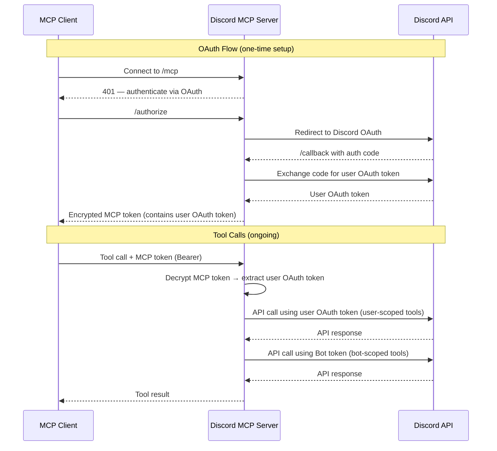

# Discord MCP Server

A Model Context Protocol (MCP) server that provides Discord integration via OAuth. Built with [FastMCP](https://github.com/jlowin/fastmcp) and the Discord API.

## Features

- **User Profile** — Get authenticated user's profile, guilds, and connections
- **Messaging** — Send, edit, delete, and read messages in channels and DMs
- **Channel Management** — Create, delete, find, and list channels
- **Category Management** — Create, delete, find categories and list their channels
- **Role Management** — Create, edit, delete, assign, and remove roles
- **Webhook Management** — Create, delete, list webhooks and send webhook messages
- **Reactions** — Add and remove emoji reactions on messages

## Prerequisites

- Python 3.10+
- A [Discord Application](https://discord.com/developers/applications) with:
  - OAuth2 enabled
  - Bot token
  - Client ID and Client Secret
  - Redirect URI set to `http://localhost:8000/auth/callback` (for local development)

## Discord App Setup

1. Go to the [Discord Developer Portal](https://discord.com/developers/applications) and create (or select) an application.
2. Under **Bot**, click "Reset Token" to get your bot token. Save it.
3. Under **OAuth2**, note the **Client ID** and **Client Secret**.
4. Under **OAuth2 > Redirects**, add your callback URL:
   - Local dev: `http://localhost:8000/auth/callback`
5. Under **OAuth2 > Scopes**, ensure `identify` and `guilds` are selected.
6. Under **Bot > Privileged Gateway Intents**, enable **Message Content Intent** if you want full message content in search results.

## Setup

1. **Clone the repository:**

   ```bash
   git clone <repo-url>
   cd discord-mcp
   ```

2. **Install dependencies:**

   ```bash
   pip install fastmcp httpx python-dotenv
   ```

3. **Create a `.env` file:**

   ```env
   BOT_TOKEN=your_bot_token
   CLIENT_ID=your_client_id
   CLIENT_SECRET=your_client_secret
   APP_URL=http://localhost:8000
   ```

4. **Run the server:**

   ```bash
   python main.py
   ```

   The server starts on `http://localhost:8000` with streamable-http transport.

## Connect with Claude Desktop

Add the following to your Claude Desktop config (`~/Library/Application Support/Claude/claude_desktop_config.json`):

```json
{
  "mcpServers": {
    "Discord MCP": {
      "command": "npx",
      "args": [
        "mcp-remote",
        "http://localhost:8000/mcp",
        "--transport",
        "http-first"
      ]
    }
  }
}
```

On first connection, Claude Desktop will redirect you to Discord to authorize via OAuth.

## Authentication Flow



**Two types of API calls:**
- **User OAuth tools** (`get_user_profile`, `get_user_guilds`, etc.) — use the authenticated user's OAuth token
- **Bot tools** (`send_message`, `create_channel`, `manage_roles`, etc.) — use the Bot token from `.env`. The bot must be invited to the server separately.

## Available Tools

| Tool | Description |
|------|-------------|
| `get_user_profile` | Get the authenticated user's Discord profile |
| `get_user_guilds` | List all guilds the user is a member of |
| `get_user_connections` | List connected accounts (Twitch, GitHub, etc.) |
| `get_guild_member` | Get user's membership info in a specific guild |
| `get_server_info` | Get detailed server information |
| `get_user_id_by_name` | Find a user's ID by username in a guild |
| `send_message` | Send a message to a channel |
| `edit_message` | Edit a message in a channel |
| `delete_message` | Delete a message from a channel |
| `read_messages` | Read recent messages from a channel |
| `send_private_message` | Send a DM to a user |
| `edit_private_message` | Edit a DM sent by the bot |
| `delete_private_message` | Delete a DM |
| `read_private_messages` | Read DM history with a user |
| `add_reaction` | Add an emoji reaction to a message |
| `remove_reaction` | Remove bot's reaction from a message |
| `create_text_channel` | Create a text channel in a guild |
| `delete_channel` | Delete a channel |
| `find_channel` | Find a channel by name |
| `list_channels` | List all channels in a guild |
| `create_category` | Create a channel category |
| `delete_category` | Delete a category |
| `find_category` | Find a category by name |
| `list_channels_in_category` | List channels in a category |
| `create_webhook` | Create a webhook on a channel |
| `delete_webhook` | Delete a webhook |
| `list_webhooks` | List webhooks on a channel |
| `send_webhook_message` | Send a message via webhook |
| `list_roles` | List all roles in a guild |
| `create_role` | Create a new role |
| `edit_role` | Modify a role's settings |
| `delete_role` | Delete a role |
| `assign_role` | Assign a role to a user |
| `remove_role` | Remove a role from a user |
